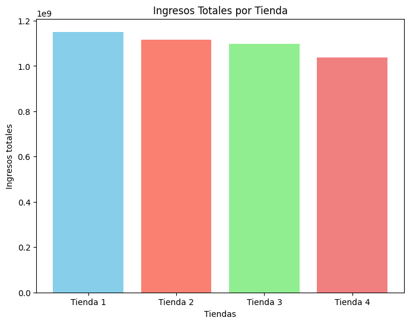
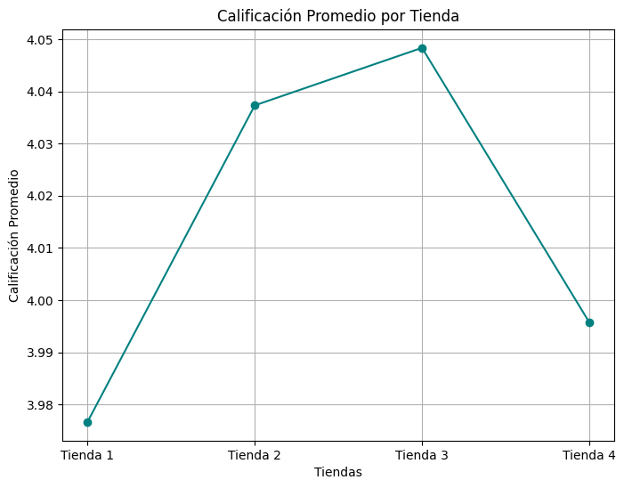
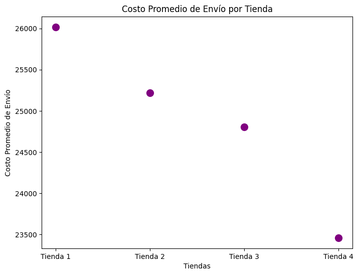

# Análisis de Datos - Desafio Data Science

## Propósito del Análisis

Este análisis tiene como objetivo [describe el objetivo principal del análisis de datos. Por ejemplo: identificar patrones en los datos de ventas, predecir el comportamiento del cliente, etc.].  Se utilizarán técnicas de [menciona las técnicas principales:  análisis exploratorio de datos, machine learning, visualización de datos, etc.] para [indica el resultado esperado:  mejorar la toma de decisiones, optimizar procesos, etc.].

## Estructura del Proyecto
El proyecto esta estructura por los siguientes archivos:
- `data/`: Carpeta que contiene los datos utilizados en el análisis (Si existieran).
- `notebooks/`: Carpeta que contiene los notebooks de Jupyter utilizados para el análisis.
- `src/`: Carpeta que contiene el código fuente del proyecto.
- `README.md`: Este archivo, que proporciona una descripción general del proyecto.
- `requirements.txt`: Archivo que contiene las dependencias necesarias para ejecutar el proyecto.

- `LICENSE`: Archivo que contiene la licencia del proyecto.


## Requisitos del Proyecto
Para ejecutar este proyecto, necesitarás tener instaladas las siguientes dependencias:
    
    ```bash
    pip install -r requirements.txt
    ```

## Ejecución del Proyecto
Para ejecutar el proyecto, puedes utilizar los notebooks de Jupyter en la carpeta `notebooks/`. Asegúrate de tener Jupyter instalado y ejecuta el siguiente comando en la terminal:

```bash
jupyter notebook
```

Esto abrirá una interfaz web donde podrás seleccionar y ejecutar los notebooks.

## Ejemplo de graficos







## Contribuciones
Si deseas contribuir a este proyecto, por favor sigue estos pasos:
1. Haz un fork del repositorio.
2. Crea una nueva rama (`git checkout -b feature/nueva-caracteristica`).
3. Realiza tus cambios y haz un commit (`git commit -m 'Añadir nueva característica'`).
4. Haz un push a la rama (`git push origin feature/nueva-caracteristica`).
5. Abre un Pull Request.


## Licencia

Este proyecto está bajo la Licencia MIT. Consulta el archivo `LICENSE` para más detalles.


## Contacto

Si tienes alguna pregunta o comentario, no dudes en contactarme a través de [tu correo electrónico] o [tu perfil de GitHub].


## Agradecimientos

Agradezco a [nombre de las personas o recursos que te ayudaron] por su apoyo y contribuciones a este proyecto.